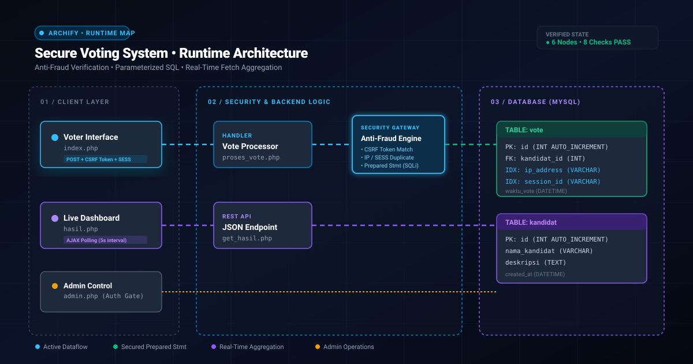

<div align="center">

# 🗳️ Secure Online Voting System
### PHP 8.x • MySQL Security Hardened • Real-Time Architecture

[](https://php.net)
[](https://mysql.com)
[](#-security-hardening-architecture)
[](LICENSE)

<p align="center">
  A lightweight, responsive, and defensive web-based voting application with anti-fraud tracking, parameterized SQL statements, CSRF protection, and asynchronous real-time polling.
</p>

</div>

---

## 🏛️ Live Runtime Architecture Map

<!-- ARCHIFY ANIMATED RUNTIME MAP -->
<div align="center">
  
</div>

<br>

| 🛡️ Guided Story: Anti-Fraud | 🔍 Route Probe: Live Stream | 🔬 Security Lens: Admin Gate |
| :--- | :--- | :--- |
| **Pencegahan Double Vote**<br>Memverifikasi `session_id()` dan `$_SERVER['REMOTE_ADDR']` untuk memblokir voting berulang sebelum data disimpan ke database. | **Real-Time Agregasi 5s**<br>JavaScript Fetch API melakukan polling asinkron ke `get_hasil.php` tanpa perlu me-reload seluruh halaman browser. | **Proteksi Akses Penuh**<br>Operasi mutasi data (Tambah, Hapus, Truncate) diproteksi autentikasi sesi admin dan verifikasi token CSRF. |

---

## 🔒 Security Hardening Architecture

1. **🛡️ Anti-Fraud Detection:**
   * Validasi ganda berbasis identitas sesi aktif dan pelacakan IP klien.
   * State verification yang langsung mengunci formulir jika suara telah terdaftar.
2. **💉 SQL Injection Immune:**
   * 100% interaksi database menggunakan Parameterized Prepared Statements (`mysqli_prepare` & `mysqli_stmt_bind_param`).
3. **🔑 CSRF Token Protection:**
   * Token kriptografi acak 32-byte (`random_bytes(32)`) diuji menggunakan `hash_equals()` pada setiap *mutating request* `POST`.
4. **🛡️ XSS Defense & Safe DOM:**
   * Sanitasi output HTML dengan `htmlspecialchars()` `ENT_QUOTES | UTF-8`.
   * Rendering grafik live voting menggunakan manipulasi properti DOM `textContent`.
5. **🍪 Hardened Session Cookies:**
   * Pengaturan cookie dengan atribut `HttpOnly`, `SameSite=Lax`, dan `Secure`.

---

## 📁 File Structure

```text
├── assets/
│   └── architecture.svg      # Runtime Architecture SVG Map
├── config.php                # Database Connection, CSRF Helper & XSS Sanitizer
├── database.sql              # Clean DDL Schema for 'kandidat' & 'vote'
├── index.php                 # Voter Interface & Candidate Selection
├── proses_vote.php           # Backend Handler & Integrity Validation
├── hasil.php                 # Real-time Live Progress Bar Dashboard
├── get_hasil.php             # JSON REST API for Live Aggregation
├── admin.php                 # Protected Administration Dashboard
└── README.md                 # Project Documentation
